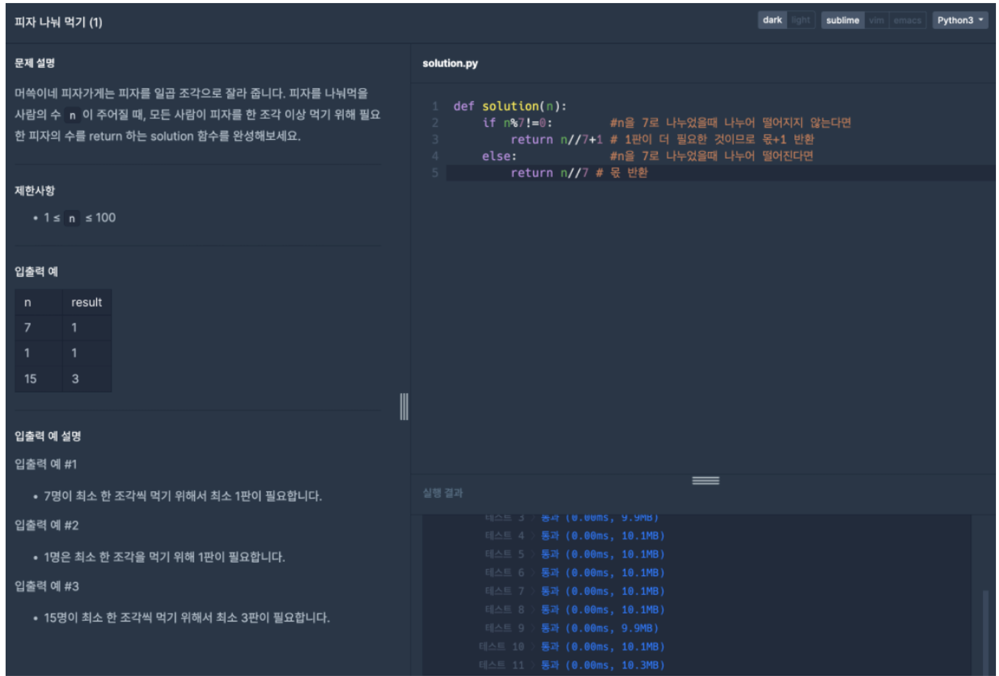

# 프로그래머스 문제 풀이

## 피자 나눠 먹기 (1)




```python

```

# 멘토링 내용

***반복문***
- 특정한 소스코드를 반복적으로 실행하고자 할 때 사용
- for문이 더 소스코드가 짧은 경우가 많다. => `<코드 1>`, `<코드 3>` 비교


- 종류
    - ***while문*** 
        - 조건문이 참일 때에 한해서, 반복적으로 코드 수행
        - 구현 방법 
            - ***while 조건문 :*** 
        - 관련 용어
            - 무한 루트 : 반복문 내부의 코드를 영원히 반복
        - 예제
            - 1부터 9까지 각 정수의 합을 계산하는 코드 `<코드 1>`
            - 1부터 9까지의 수 중에서 홀수만 더하는 코드 `<코드 2>`
    - ***for문*** 
        - 구현 방법
            - ***for 변수 in 리스트 :***
            - 리스트 자리에 리스트, 튜플, 문자열 등이 올 수 있다.
            - 수를 ***차례대로 나열***할 때 쓰는 코드 : ***range(시작 값, 끝 값+1)***  `<코드 3>` 
                - range안에 ***하나의 값***만 적는다면 => ***시작값 = 0*** `<코드 4>`   

            
- 반복문 안에서 continue를 만나면, 프로그램의 흐름은 반복문의 처음으로 돌아간다. `<코드 5>` 
- 반복문은 중첩해서 사용할 수 있다. `<코드 6>`      


```python
#코드 1 : 1부터 9까지 각 정수의 합을 계산하는 코드
i=1 #시작 수
result=0 #결과 초기값

while i <= 9: #i가 9보다 작거나 같을 때
    result+=i #반복할 코드 1 : 결과에 i 더하기
    i+=1      #반복할 코드 2 : 1~9까지의 정수 i 정의
    
print(result) #결과 출력
```

    45


```python
#코드 2 : 1부터 9까지의 수 중에서 홀수만 더하는 코드
i=1 #시작 수
result=0 #결과 초기값

while i <= 9: #i가 9보다 작거나 같을 때
    if i%2==1:    #반복할 코드 1 : i가 홀수일 때
        result+=i #반복할 코드 2 : 결과에 i 더하기
    i+=1          #반복할 코드 3 : 1~9까지의 정수 i 정의
    
print(result)     #결과 출력
```

    25


```python
#코드 3 : 1부터 9까지 각 정수의 합을 계산하는 코드
i=1 #시작 수
result=0 #결과 초기값

for i in range(1,10): #i가 1부터 9일때까지 
    result+=i         #결과에 i 더하기
    
print(result)         #결과 출력
```

    45


```python
#코드 4 : 학생의 번호를 1번부터 매긴다고 했을 때, 합격한 학생의 번호를 출력하는 코드
score=[90,85,77,65,97] #불러올 데이터

for i in range(5): #i가 0부터 4일 때까지
    if score[i]>=80: #i번째 학생의 점수가 80점 이상일때
        print(i+1, "번 학생은 합격입니다.") #결과 출력
```

    1 번 학생은 합격입니다.
    2 번 학생은 합격입니다.
    5 번 학생은 합격입니다.


```python
#코드 5 : 블랙리스트에 해당되는 번호를 제외하고, 합격한 학생의 번호를 출력하는 코드
score=[90,85,77,65,97] #불러올 데이터
cheating_list=[2,4] #블랙리스트 리스트

for i in range(5): #i가 0부터 4일 때까지
    if i+1 in cheating_list: #만약 i가 블랙리스트 리스트에 올라왔다면
        continue #i+1로 넘어간다.
    if score[i]>=80: #i번째 학생이 블랙리스트에도 올라오지 않았고, 점수가 80점 이상일때
        print(i+1, "번 학생은 합격입니다.") #결과 출력
```

    1 번 학생은 합격입니다.
    5 번 학생은 합격입니다.


```python
#코드 6 : 2중 반복문 사용되는 예시 "구구단" ########멘토멘티 사후시험 예상 문제########
for i in range(2,10): #2단부터 9단까지
    for j in range(1,10): #1부터 9까지 
        print(i,"X",j,"=",i*j) #2단부터 9단까지 각 단마다 1부터 9까지 곱하여 결과 출력
    print() # 각 단을 띄어쓰기로 구분
```

    2 X 1 = 2
    2 X 2 = 4
    2 X 3 = 6
    2 X 4 = 8
    2 X 5 = 10
    2 X 6 = 12
    2 X 7 = 14
    2 X 8 = 16
    2 X 9 = 18
    
    3 X 1 = 3
    3 X 2 = 6
    3 X 3 = 9
    3 X 4 = 12
    3 X 5 = 15
    3 X 6 = 18
    3 X 7 = 21
    3 X 8 = 24
    3 X 9 = 27
    
    4 X 1 = 4
    4 X 2 = 8
    4 X 3 = 12
    4 X 4 = 16
    4 X 5 = 20
    4 X 6 = 24
    4 X 7 = 28
    4 X 8 = 32
    4 X 9 = 36
    
    5 X 1 = 5
    5 X 2 = 10
    5 X 3 = 15
    5 X 4 = 20
    5 X 5 = 25
    5 X 6 = 30
    5 X 7 = 35
    5 X 8 = 40
    5 X 9 = 45
    
    6 X 1 = 6
    6 X 2 = 12
    6 X 3 = 18
    6 X 4 = 24
    6 X 5 = 30
    6 X 6 = 36
    6 X 7 = 42
    6 X 8 = 48
    6 X 9 = 54
    
    7 X 1 = 7
    7 X 2 = 14
    7 X 3 = 21
    7 X 4 = 28
    7 X 5 = 35
    7 X 6 = 42
    7 X 7 = 49
    7 X 8 = 56
    7 X 9 = 63
    
    8 X 1 = 8
    8 X 2 = 16
    8 X 3 = 24
    8 X 4 = 32
    8 X 5 = 40
    8 X 6 = 48
    8 X 7 = 56
    8 X 8 = 64
    8 X 9 = 72
    
    9 X 1 = 9
    9 X 2 = 18
    9 X 3 = 27
    9 X 4 = 36
    9 X 5 = 45
    9 X 6 = 54
    9 X 7 = 63
    9 X 8 = 72
    9 X 9 = 81
    


```python

```
